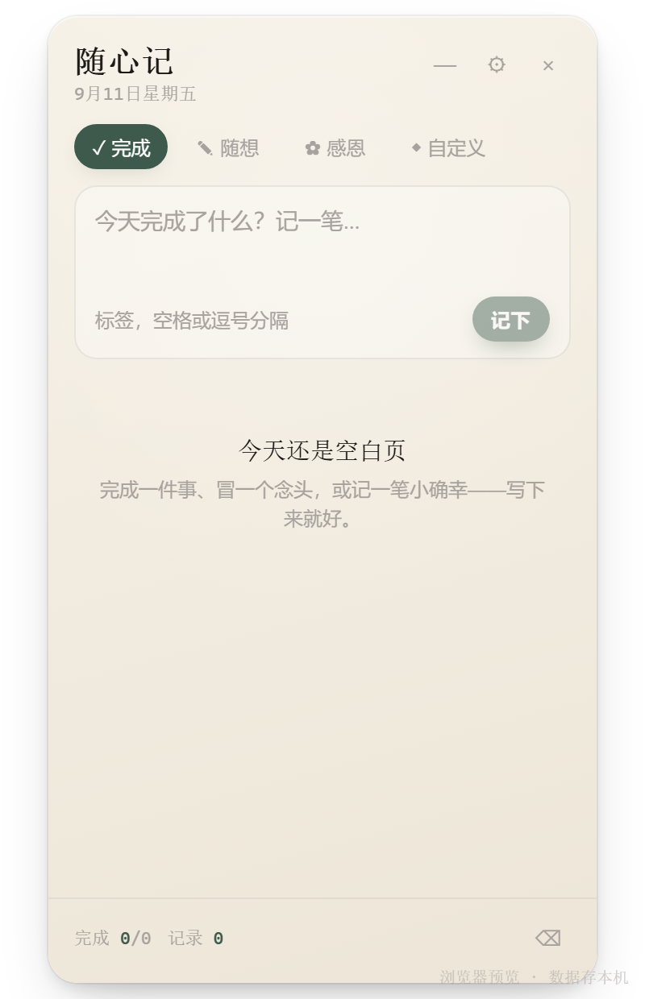
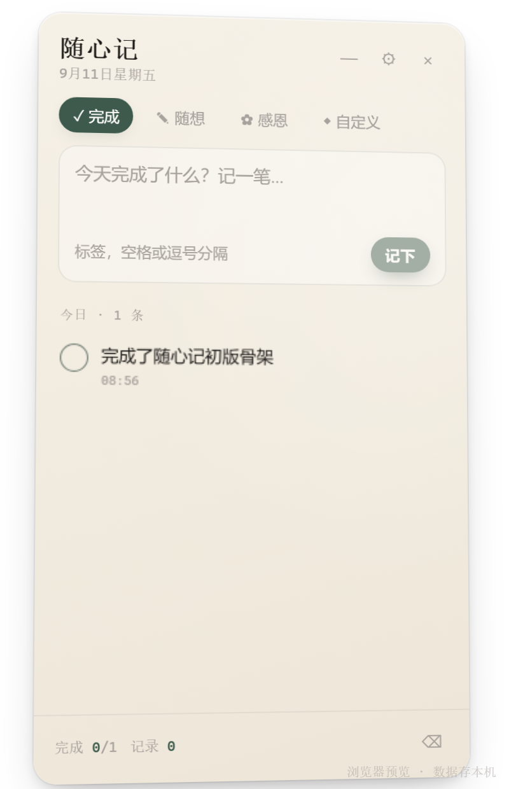
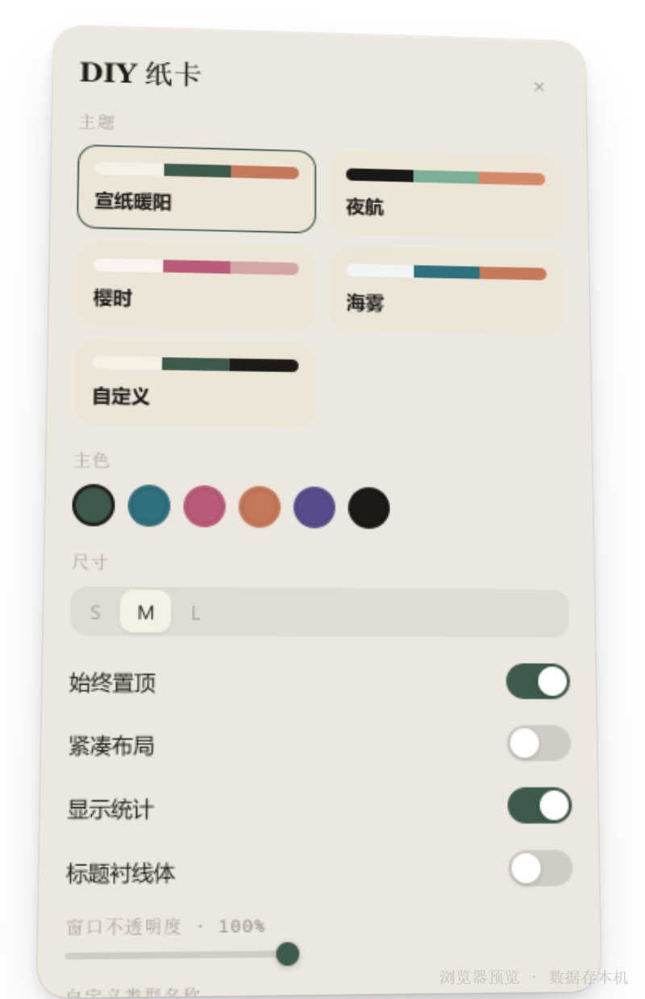

# 随心记 · Suixinji

桌面悬浮「随心卡片」：随手记下今天完成的事、冒出的念头，或值得感恩的小瞬间。

纸质感 3D 卡片 · 鼠标跟随倾斜 · 主题可 DIY · 本地存储 · Windows 可打包 exe。





## 功能

- **四种记录类型**：完成 / 随想 / 感恩 / 自定义名称
- **标签与今日统计**，回车即可记下
- **3D 纸卡**：指针跟随倾斜 + 高光，完成时轻微回弹
- **主题**：宣纸暖阳 / 夜航 / 樱时 / 海雾 / 自定义主色
- **窗口**：始终置顶、紧凑布局、透明度、位置记忆；关闭收进托盘
- **数据全在本机**：`%APPDATA%\suixinji\suixinji\data.json`

## 下载

去 [Releases](../../releases) 下载：

| 文件 | 说明 |
|------|------|
| `suixinji-x.y.z-setup.exe` | 安装版（推荐） |
| `suixinji-x.y.z-portable.exe` | 单文件便携版 |

> 未做代码签名时，Windows SmartScreen 可能提示。点「更多信息 → 仍要运行」。

## 开发

```bash
npm install
# 若 electron.exe 未自动下载：
node node_modules/electron/install.js

npm run dev            # 浏览器预览
npm run electron:dev   # Electron 悬浮窗
npm run typecheck
```

### 打包 Windows

```bash
npm run dist
```

产物在 `release/`。脚本会设置 `ELECTRON_BUILDER_CACHE`，避免部分 Windows 环境解压 winCodeSign 因符号链接权限失败。

## 技术栈

- Electron 35 · React 19 · TypeScript · Vite 6
- electron-builder（NSIS + portable）
- 无后端、无账号、无遥测

## 目录结构

```
suixinji/
├── electron/          # 主进程、preload
├── src/               # React 界面
├── build/             # 应用图标（electron-builder）
├── docs/              # README 截图与图标源
├── scripts/           # 打包 / 截图脚本
├── .github/workflows/ # Windows CI 打包 / Release
├── DESIGN.md          # 设计规格
├── CHANGELOG.md
└── package.json
```

更新 README 截图：

```bash
npm run dev          # 另开终端
npm run shot         # 写入 docs/screenshots/
```

## 设计说明

风格锚点：日式文具纸质卡片 × 组件级信息密度。详见 [DESIGN.md](./DESIGN.md)。

版本记录见 [CHANGELOG.md](./CHANGELOG.md)。

## 开源协议

[MIT](./LICENSE)
